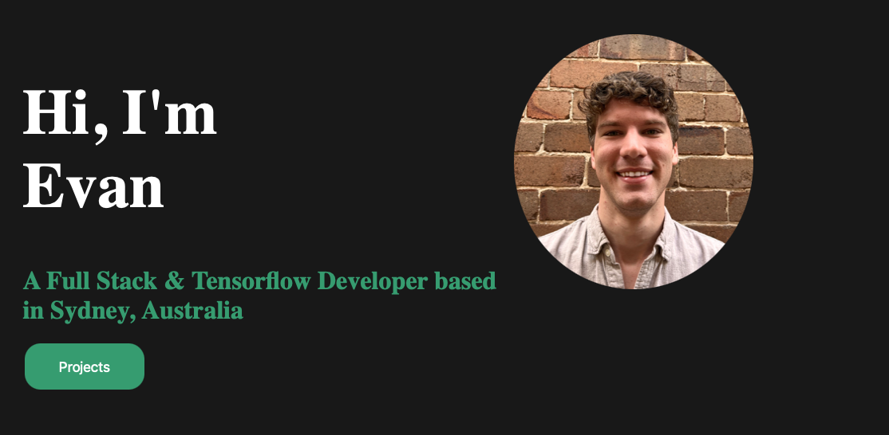

# Evan-Woods-Updated-Portfolio

## License

https://opensource.org/licenses/MIT

## Table of Contents
* [Description](#description) 
* [Contribution Guide](#contribute)
* [Tests](#tests)
* [Questions](#questions)

## Description
This project is my updated personal portfolio using Handlebars js and Model-View-Controller techniques. The app is hosted on Heroku and is viewable at this URL: https://evan-woods-updated-portfolio.herokuapp.com 

The user is presented with a landing page on arrival at the website that allows them to navigate the site and learn more about me as a developer email

## Contribute
This app has been finished and does not require any further development.

## Tests
This app does not have any tests.

## Questions
For any questions about the code please see my github for source code, email me at the address provided, or find my social media links on my portfolio website. 
* https://github.com/EvanCWoods
* evan.woods.dev@gmail.com
* https://evan-woods-updated-portfolio.herokuapp.com